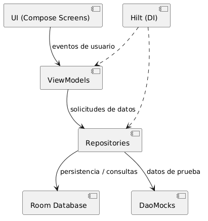
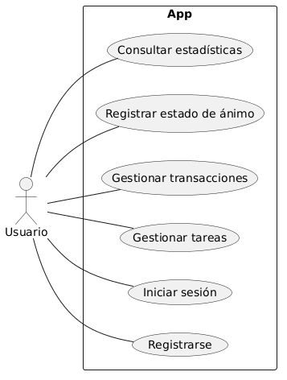
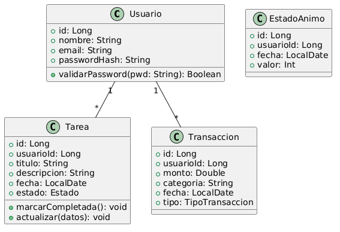

# Planify — Documentación del Proyecto

## Índice
- [1. Título](#1-título)
- [2. Introducción](#2-introducción)
  - [2.1 Objetivo](#21-objetivo)
  - [2.2 Justificación](#22-justificación)
  - [2.3 Análisis de lo existente](#23-análisis-de-lo-existente)
- [3. Requisitos funcionales de la aplicación](#3-requisitos-funcionales-de-la-aplicación)
- [4. Análisis y Diseño](#4-análisis-y-diseño)
  - [4.1 Diagrama de arquitectura](#41-diagrama-de-arquitectura)
  - [4.2 Módulos y despliegue](#42-módulos-y-despliegue)
  - [4.3 Diagrama de casos de uso](#43-diagrama-de-casos-de-uso)
  - [4.4 Diagrama de clases](#44-diagrama-de-clases-atributos-y-métodos)
  - [4.5 Diseño de datos](#45-diseño-de-datos-bd-relacional--room--sqlite)
- [5. Codificación](#5-codificación)
  - [5.1 Entorno de programación](#51-entorno-de-programación)
  - [5.2 Lenguajes y herramientas](#52-lenguajes-y-herramientas)
  - [5.3 Aspectos relevantes de la implementación](#53-aspectos-relevantes-de-la-implementación)
- [6. Manual de usuario](#6-manual-de-usuario)
- [7. Requisitos e instalación](#7-requisitos-e-instalación)
- [8. Conclusiones](#8-conclusiones)
- [9. Bibliografía](#9-bibliografía)

---

## 1. Título

**Planify** — Aplicación móvil Android para la gestión personal: tareas, rutinas de gimnasio y control de finanzas personales.

---

## 2. Introducción

### 2.1 Objetivo

El objetivo de este proyecto es desarrollar una aplicación móvil Android que permita al usuario gestionar en un único lugar los tres pilares de su rutina diaria: la **planificación de tareas**, el **seguimiento de rutinas de entrenamiento** y el **control de sus finanzas personales**. Adicionalmente, la aplicación incorpora un módulo de **seguimiento del estado de ánimo** para que el usuario pueda detectar correlaciones entre su bienestar emocional, su actividad física y su situación económica.

La aplicación está desarrollada con tecnologías modernas del ecosistema Android: **Kotlin**, **Jetpack Compose**, **Room** y **Hilt**, siguiendo la arquitectura **MVVM** (Model-View-ViewModel) recomendada por Google.

### 2.2 Justificación

En la actualidad, la mayoría de los usuarios que desean llevar un control personal de su vida cotidiana se ven obligados a alternar entre varias aplicaciones especializadas: una para gestionar las tareas pendientes, otra para registrar los gastos, otra para planificar el entrenamiento físico y otra para el seguimiento del ánimo. Este modelo fragmentado genera fricción, pérdida de tiempo y dificulta la visión global del bienestar personal.

Planify nace para **centralizar estas funcionalidades** en una única aplicación coherente, ofreciendo:

- Una experiencia de usuario fluida y unificada.
- Acceso inmediato a todos los módulos desde un dashboard principal.
- La posibilidad de observar la relación entre hábitos, economía y estado emocional.
- Persistencia local completa mediante Room, sin necesidad de conexión a internet para el uso básico.

La aplicación está dirigida a **usuarios adultos con conocimientos básicos de tecnología** que deseen mejorar su organización personal sin tener que aprender múltiples interfaces.

### 2.3 Análisis de lo existente

#### Aplicaciones en el mercado

En el mercado existen múltiples soluciones parciales que cubren alguna de las funcionalidades de Planify:

| Aplicación | Funcionalidad cubierta | Limitación frente a Planify |
|---|---|---|
| **Todoist / TickTick** | Gestión de tareas y calendario | No integra economía ni salud |
| **Mint / Wallet** | Control de finanzas personales | No integra tareas ni entrenamiento |
| **MyFitnessPal / Strong** | Registro de rutinas de gimnasio | No integra tareas ni finanzas |
| **Daylio** | Registro del estado de ánimo | No integra las demás funcionalidades |
| **Notion** | Notas y gestión flexible | Requiere configuración avanzada, sin módulos específicos de salud/finanzas |

El **nivel de innovación** de Planify reside en la **integración** de estos cuatro módulos en una sola app nativa Android, con una interfaz moderna basada en Material 3 y sin dependencia de servicios en la nube para el funcionamiento básico.

#### Evolución interna del proyecto

El proyecto ha pasado por varias iteraciones de diseño antes de alcanzar su versión actual:

- **BocetoClases** (C#): primer prototipo conceptual de las clases del dominio.
- **BocetoV2** (Java): traducción a Java con separación en capas (Controllers, DAO, DaoMock).
- **ProyectoEx** (C#): refinamiento del modelo de datos.
- **AppV1 → AppV3** (Android/Kotlin): primeras versiones de la app móvil, progresivamente enriquecidas con UI en Compose.
- **AppV4** (Android/Kotlin + MVVM + Room + Hilt): versión final reestructurada, con arquitectura limpia, persistencia real y navegación unificada.

---

## 3. Requisitos funcionales de la aplicación

Planify está dirigida a un **único tipo de usuario** (usuario estándar registrado) con un nivel de experiencia tecnológica básico-medio. No se requiere ningún conocimiento técnico previo para utilizarla.

Los requisitos funcionales principales son:

**Autenticación y gestión de cuenta**
- RF01 — El usuario puede registrarse con nombre, correo electrónico y contraseña.
- RF02 — El usuario puede iniciar y cerrar sesión en la aplicación.
- RF03 — El usuario puede editar su perfil (nombre, correo) desde la sección de ajustes.

**Gestión de tareas**
- RF04 — El usuario puede crear tareas con título, descripción, fecha y etiqueta de categoría (Trabajo, Salud, Hogar, Personal, Otros).
- RF05 — El usuario puede marcar tareas como completadas o pendientes.
- RF06 — El usuario puede eliminar tareas.
- RF07 — El usuario puede filtrar tareas por etiqueta o por fecha usando el calendario integrado.
- RF08 — El usuario puede navegar por el calendario mensual para consultar tareas de días anteriores y futuros.

**Gestión de finanzas personales**
- RF09 — El usuario puede registrar transacciones económicas (gastos e ingresos) con importe, categoría y fecha.
- RF10 — El usuario puede consultar el historial de transacciones.
- RF11 — El usuario puede visualizar estadísticas de gasto por categoría y periodo en la pantalla de análisis de gastos.
- RF12 — El dashboard muestra el saldo disponible calculado en tiempo real.

**Rutinas de gimnasio**
- RF13 — El usuario puede crear ejercicios de gimnasio con nombre, grupo muscular, número de series, repeticiones y peso.
- RF14 — El usuario puede consultar, editar y eliminar sus rutinas de entrenamiento.
- RF15 — Los ejercicios quedan almacenados localmente con persistencia en Room.

**Registro del estado de ánimo**
- RF16 — El usuario puede registrar su estado de ánimo diario mediante un valor numérico.
- RF17 — El usuario puede consultar el historial de estados de ánimo registrados.

**Ajustes**
- RF18 — El usuario puede acceder a una pantalla de ajustes con secciones de perfil, notificaciones y privacidad.
- RF19 — El usuario puede modificar sus datos de perfil desde los ajustes.

---

## 4. Análisis y Diseño

La aplicación sigue el patrón arquitectónico **MVVM** (Model-View-ViewModel) con las siguientes capas bien diferenciadas:

- **UI (View):** pantallas Compose que observan el estado del ViewModel.
- **ViewModel:** gestiona el estado de la UI y delega la lógica al repositorio.
- **Repository:** abstrae el origen de los datos (Room DAO o mock).
- **Data / Room:** entidades `@Entity`, DAOs `@Dao`, base de datos `PlanifyDB`.

La inyección de dependencias se gestiona con **Hilt**, que conecta los repositorios con los ViewModels sin acoplamiento manual.

### 4.1 Diagrama de arquitectura

El siguiente diagrama muestra las capas de la aplicación y sus relaciones:



> Generado con PlantUML. Fuente: `Documentacion/diagrams/architecture.puml`

La aplicación es de tipo **móvil nativa Android** (un único módulo `app`). No requiere servicios externos para su funcionamiento básico. Las integraciones con servicios REST, Firebase Auth o Firestore están planificadas como ampliaciones futuras.

### 4.2 Módulos y despliegue

El proyecto se organiza en los siguientes paquetes dentro del módulo `app`:

| Paquete | Contenido |
|---|---|
| `com.pmdm.planify.models` | Clases de dominio: `Usuario`, `Tarea`, `Transaccion`, `Rutina`, `EstadoAnimo`, `Enums` |
| `com.pmdm.planify.data` | Repositorios y converters: `TareaRepository`, `TransaccionRepository`, `RutinaRepository`, `EstadoAnimoRepository`, `UsuarioRepository`, `LoginRepository`, `UserSessionRepository` |
| `com.pmdm.planify.data.room` | Capa Room: `PlanifyDB`, entidades (`TareaEntity`, `TransaccionEntity`, `RutinaEntity`, `UsuarioEntity`, `EstadoAnimoRegistroEntity`), DAOs, `Converters` |
| `com.pmdm.planify.data.daomocks` | Implementaciones mock de los DAOs para pruebas sin base de datos real |
| `com.pmdm.planify.data.mocks` | Datos de prueba estáticos por funcionalidad |
| `com.pmdm.planify.ui.features` | Pantallas Compose agrupadas por feature: `Login`, `VentanaPrincipal`, `Tareas`, `Economia`, `RutinasDeGimnasio`, `EstadoDeAnimo`, `Ajustes`, `Componentes` |
| `com.pmdm.planify.ui.navigation` | Rutas de navegación: `NavHostPlanify`, `LoginRoute`, `HomeRoute`, `TareaRoute`, `EconomiaRoute`, `GymRoute`, `EstadoAnimoRoute`, `SettingsRoute`, `TransaccionRoute` |
| `com.pmdm.planify.ui.theme` | Tema Material 3: `Color`, `Theme`, `Type` |
| `com.pmdm.planify.views` | `MainActivity`: punto de entrada de la app |
| `com.pmdm.planify.di` | `PlanifyApp`: clase `Application` de Hilt con precarga de datos |

**Flujo de arranque:**
```
PlanifyApp.onCreate()
  └─ PlanifyDB.getDatabase()          // crea la BD Room en disco
  └─ precargarDatos()                  // inserta datos iniciales si la BD está vacía
        └─ MainActivity
              └─ NavHostPlanify        // LoginScreen → DashboardScreen → features
```

### 4.3 Diagrama de casos de uso

El siguiente diagrama muestra los casos de uso principales del sistema para el actor **Usuario**:



> Generado con PlantUML. Fuente: `Documentacion/diagrams/usecases.puml`

Los casos de uso principales son:
- **Registrarse / Iniciar sesión**
- **Gestionar tareas** (crear, completar, filtrar, eliminar)
- **Gestionar rutinas de gimnasio** (crear, ver, editar, eliminar ejercicios)
- **Gestionar transacciones** (registrar gasto/ingreso, consultar historial)
- **Consultar análisis de gastos** (ver estadísticas por categoría)
- **Registrar estado de ánimo** (registrar valor diario, ver historial)
- **Configurar ajustes** (editar perfil, gestionar notificaciones y privacidad)

### 4.4 Diagrama de clases (atributos y métodos)

El siguiente diagrama muestra las principales clases del dominio con sus atributos y relaciones:



> Generado con PlantUML. Fuente: `Documentacion/diagrams/classes.puml`

Las clases del dominio más relevantes son:

**`Usuario`**: representa la cuenta del usuario en la app.
- `id: Long`, `nombre: String`, `email: String`, `password: String`
- `validarCredenciales(email, password): Boolean`

**`Tarea`**: representa una tarea personal con categoría y fecha.
- `id: String`, `usuarioId: Long`, `titulo: String`, `descripcion: String`, `fecha: LocalDateTime`, `etiqueta: EtiquetaTarea`, `completada: Boolean`
- `marcarCompletada()`, `actualizar(datos)`

**`Transaccion`**: registra un movimiento económico.
- `id: Long`, `usuarioId: Long`, `monto: Double`, `categoria: String`, `fecha: LocalDate`, `tipo: TipoTransaccion` (GASTO / INGRESO)

**`Rutina`**: representa un ejercicio de la rutina de gimnasio.
- `id: Long`, `usuarioId: Long`, `nombre: String`, `musculo: String`, `series: Int`, `repeticiones: Int`, `peso: Float`

**`EstadoAnimoRegistro`**: almacena el estado emocional diario.
- `id: Long`, `usuarioId: Long`, `fecha: LocalDate`, `valor: Int`, `nota: String?`

**Enumeraciones:**
- `EtiquetaTarea`: TRABAJO, SALUD, HOGAR, PERSONAL, OTROS
- `TipoTransaccion`: GASTO, INGRESO

**Relaciones:**
- `Usuario` 1 — * `Tarea`
- `Usuario` 1 — * `Transaccion`
- `Usuario` 1 — * `Rutina`
- `Usuario` 1 — * `EstadoAnimoRegistro`

### 4.5 Diseño de datos (BD relacional — Room / SQLite)

La aplicación usa **Room** sobre **SQLite** como base de datos local. Se definen **cinco tablas** con claves ajenas a `Usuario` y borrado en cascada (`onDelete = CASCADE`).

#### Tabla `Usuario`

| Campo | Tipo | Restricción |
|---|---|---|
| `id` | INTEGER | PK, autoincrement |
| `nombre` | TEXT | NOT NULL |
| `email` | TEXT | NOT NULL |
| `password` | TEXT | NOT NULL |

#### Tabla `Tarea`

| Campo | Tipo | Restricción |
|---|---|---|
| `id` | INTEGER | PK, autoincrement |
| `usuarioId` | INTEGER | FK → Usuario(id), CASCADE |
| `titulo` | TEXT | NOT NULL |
| `descripcion` | TEXT | nullable |
| `fecha` | TEXT | nullable (ISO-8601) |
| `estado` | TEXT | NOT NULL (PENDIENTE / EN_CURSO / COMPLETADA) |

#### Tabla `Transaccion`

| Campo | Tipo | Restricción |
|---|---|---|
| `id` | INTEGER | PK, autoincrement |
| `usuarioId` | INTEGER | FK → Usuario(id), CASCADE |
| `monto` | REAL | NOT NULL |
| `categoria` | TEXT | NOT NULL |
| `fecha` | TEXT | NOT NULL (ISO-8601) |
| `tipo` | TEXT | NOT NULL (GASTO / INGRESO) |

#### Tabla `Rutina`

| Campo | Tipo | Restricción |
|---|---|---|
| `id` | INTEGER | PK, autoincrement |
| `usuarioId` | INTEGER | FK → Usuario(id), CASCADE |
| `nombre` | TEXT | NOT NULL |
| `musculo` | TEXT | NOT NULL |
| `series` | INTEGER | NOT NULL |
| `repeticiones` | INTEGER | NOT NULL |
| `peso` | REAL | NOT NULL |

#### Tabla `EstadoAnimoRegistro`

| Campo | Tipo | Restricción |
|---|---|---|
| `id` | INTEGER | PK, autoincrement |
| `usuarioId` | INTEGER | FK → Usuario(id), CASCADE |
| `fecha` | TEXT | NOT NULL (ISO-8601) |
| `valor` | INTEGER | NOT NULL (1–5) |
| `nota` | TEXT | nullable |

**Diagrama Entidad/Relación simplificado:**
```
[Usuario] ──< [Tarea]
[Usuario] ──< [Transaccion]
[Usuario] ──< [Rutina]
[Usuario] ──< [EstadoAnimoRegistro]
```

---

## 5. Codificación

### 5.1 Entorno de programación

| Herramienta | Versión | Uso |
|---|---|---|
| Android Studio | Hedgehog 2023.1.1+ | IDE principal |
| JDK | 17 | Compilación |
| Gradle | 8.x (Kotlin DSL) | Sistema de build |
| Emulador Android | API 29–34 | Pruebas durante el desarrollo |
| Git | 2.x | Control de versiones (GitHub) |
| PlantUML | — | Generación de diagramas |

El código fuente está alojado en GitHub en el repositorio `ElGranCombopi2damiesbalmis/proyecto`.

### 5.2 Lenguajes y herramientas

**Lenguajes:**
- **Kotlin** (100% del código Android): lenguaje oficial de Android, con soporte nativo para corrutinas, null-safety y funciones de extensión que simplifican enormemente el código respecto a Java.

**Bibliotecas y frameworks principales:**

| Biblioteca | Función |
|---|---|
| **Jetpack Compose** | UI declarativa en Kotlin, reemplaza XML layouts |
| **Material 3** | Sistema de diseño visual de Google |
| **Room** | ORM sobre SQLite para persistencia local |
| **Hilt** | Inyección de dependencias basada en Dagger |
| **Navigation Compose** | Navegación entre pantallas |
| **ViewModel + StateFlow** | Gestión de estado reactivo de la UI |
| **Coroutines** | Operaciones asíncronas (acceso a BD, etc.) |

**Por qué Kotlin + Compose:**  
Kotlin es el lenguaje oficial de Android desde 2019 y proporciona null-safety, corrutinas nativas y una sintaxis mucho más concisa que Java. Jetpack Compose elimina la verbosidad de XML y permite construir UI directamente en Kotlin con una mentalidad declarativa, reduciendo el número de archivos y la necesidad de adapters, fragments, etc.

**Por qué Room:**  
Room es la solución oficial de Google para persistencia local en Android. Proporciona comprobación en tiempo de compilación de las consultas SQL, soporte nativo para corrutinas y tipos Kotlin, y una API limpia basada en anotaciones. Esto lo hace superior a SQLiteOpenHelper nativo o a soluciones como Realm para proyectos de tamaño medio.

**Por qué Hilt:**  
Hilt simplifica la inyección de dependencias en Android, integrándose con `ViewModel`, `Application` y el ciclo de vida de Android sin código boilerplate. Permite sustituir implementaciones reales por mocks fácilmente.

### 5.3 Aspectos relevantes de la implementación

A continuación se muestran los fragmentos de código más representativos de la arquitectura de la aplicación.

#### Precarga de datos inicial — `PlanifyApp.kt`

La clase `PlanifyApp` extiende `Application` y se ejecuta al arrancar la app. Si la base de datos está vacía, inserta un usuario demo con tareas, transacciones y rutinas de ejemplo. Esto garantiza que el usuario siempre disponga de contenido visible en el primer acceso.

```kotlin
class PlanifyApp : Application() {

    lateinit var database: PlanifyDB

    override fun onCreate() {
        super.onCreate()
        // Inicializa el singleton de la base de datos Room
        database = PlanifyDB.getDatabase(this)

        // Lanza la precarga en un hilo de I/O (no bloquea la UI)
        CoroutineScope(Dispatchers.IO).launch {
            precargarDatos()
        }
    }

    /**
     * Inserta datos de ejemplo sólo si la base de datos está completamente vacía.
     * Garantiza que el usuario disponga de contenido desde el primer inicio.
     */
    private suspend fun precargarDatos() {
        val usuarioDao = database.usuarioDao()

        // Guarda no hace nada si ya hay datos
        if (usuarioDao.getAll().isEmpty()) {
            val userId = /* ... insertar usuario demo y obtener su id */

            // Tareas de ejemplo para distintas fechas
            database.tareaDao().insert(TareaEntity(userId, "Comprar leche", "Supermercado", LocalDate.now(), "PENDIENTE"))

            // Transacciones de ejemplo (ingresos y gastos)
            database.transaccionDao().insert(TransaccionEntity(userId, 1200.0, "Salario", LocalDate.now().minusDays(5), "INGRESO"))

            // Rutinas de gimnasio de ejemplo
            database.rutinaDao().insert(RutinaEntity(userId, "Press banca", "Pecho", 3, 10, 60.0f))
            database.rutinaDao().insert(RutinaEntity(userId, "Sentadilla", "Piernas", 4, 8, 80.0f))
        }
    }
}
```

#### Entidad Room con clave ajena — `RutinaEntity.kt`

Cada ejercicio de la rutina de gimnasio se mapea a la tabla `Rutina`. La anotación `@ForeignKey` garantiza integridad referencial y el borrado en cascada cuando se elimina el usuario.

```kotlin
@Entity(
    tableName = "Rutina",
    foreignKeys = [ForeignKey(
        entity = UsuarioEntity::class,
        parentColumns = ["id"],
        childColumns = ["usuarioId"],
        // Si se elimina el usuario, se eliminan todas sus rutinas
        onDelete = ForeignKey.CASCADE
    )]
)
data class RutinaEntity(
    val usuarioId: Long,       // FK al usuario propietario
    val nombre: String,        // Nombre del ejercicio, ej. "Press banca"
    val musculo: String,       // Grupo muscular trabajado, ej. "Pecho"
    val series: Int,           // Número de series
    val repeticiones: Int,     // Repeticiones por serie
    val peso: Float,           // Peso en kg (0.0 si es con peso corporal)
    @PrimaryKey(autoGenerate = true) val id: Long = 0
)
```

#### Patrón Repository con Converter — `TareaRepository.kt`

El repositorio actúa como única fuente de verdad para las tareas. Convierte entre la entidad de Room (`TareaEntity`) y el modelo de dominio (`Tarea`) usando un objeto converter, desacoplando completamente la capa de datos de la capa de negocio.

```kotlin
class TareaRepository(private val tareaDao: TareaDao) {

    /** Obtiene todas las tareas de un usuario, convertidas al modelo de dominio */
    suspend fun getAll(usuarioId: Long): List<Tarea> {
        return tareaDao.getAll(usuarioId)
            .map { TareaRepositoryConverter.toModel(it) }  // Entity → Model
    }

    /** Inserta una nueva tarea; devuelve el id generado */
    suspend fun insert(tarea: Tarea): Long {
        return tareaDao.insert(TareaRepositoryConverter.toEntity(tarea))  // Model → Entity
    }

    /** Actualiza los datos de una tarea existente */
    suspend fun update(tarea: Tarea) {
        tareaDao.update(TareaRepositoryConverter.toEntity(tarea))
    }

    /** Elimina una tarea de la base de datos */
    suspend fun delete(tarea: Tarea) {
        tareaDao.delete(TareaRepositoryConverter.toEntity(tarea))
    }
}
```

#### ViewModel con UiState y Hilt — `TareaViewModel.kt`

El ViewModel centraliza todo el estado de la pantalla de tareas en una única data class (`TareaUiState`). El estado se expone como `StateFlow` (inmutable para la UI) y se actualiza usando `update {}`. La anotación `@HiltViewModel` permite que Hilt gestione su creación e inyecte los repositorios automáticamente.

```kotlin
/** Estado completo de la UI de la pantalla de tareas */
data class TareaUiState(
    val tareas: List<TareaMock>       = emptyList(),
    val isLoading: Boolean            = false,
    val filtroSeleccionado: String    = "Todos",
    val mostrarDialogo: Boolean       = false,
    val tituloNueva: String           = "",
    val etiquetaNueva: EtiquetaTarea  = EtiquetaTarea.OTROS,
    val errorTitulo: Boolean          = false,
    val fechaSeleccionada: LocalDate  = LocalDate.now(),
    val mesVisible: YearMonth         = YearMonth.now()
)

@HiltViewModel  // Hilt gestiona el ciclo de vida y la inyección
class TareaViewModel @Inject constructor(
    private val tareaRepository: TareaRepository,
    private val usuarioRepo: UsuarioRepository,
    private val sessionRepo: UserSessionRepository  // sesión del usuario actual
) : ViewModel() {

    private val _uiState = MutableStateFlow(TareaUiState())
    val uiState: StateFlow<TareaUiState> = _uiState.asStateFlow()  // sólo lectura para la UI

    init { cargarTareas() }  // carga al instanciar

    fun cargarTareas() {
        viewModelScope.launch {
            _uiState.update { it.copy(isLoading = true) }
            val lista = tareaRepository.getAll().map { it.toTareaMock() }
            _uiState.update { it.copy(tareas = lista, isLoading = false) }
        }
    }

    fun guardarTarea() {
        val s = _uiState.value
        if (s.tituloNueva.isBlank()) { _uiState.update { it.copy(errorTitulo = true) }; return }
        viewModelScope.launch {
            val nueva = Tarea(titulo = s.tituloNueva.trim(), etiqueta = s.etiquetaNueva, fecha = LocalDateTime.now())
            tareaRepository.insert(nueva)
            _uiState.update { it.copy(tareas = it.tareas + nueva.toTareaMock(), mostrarDialogo = false) }
        }
    }
}
```

---

## 6. Manual de usuario

### Tipos de usuario

Planify tiene un único tipo de usuario: el **usuario registrado**. No existe rol administrador ni cuenta de invitado. Cualquier persona con un dispositivo Android puede crear su propia cuenta local y comenzar a usar la aplicación de inmediato.

### Pantallas principales

#### Pantalla de Login / Registro

Al abrir la app por primera vez se muestra la pantalla de inicio de sesión. El usuario puede:
- Introducir su correo y contraseña para iniciar sesión.
- Pulsar "Registrarse" para crear una cuenta nueva introduciendo nombre, correo y contraseña.

Si la base de datos está vacía, la app precarga automáticamente un usuario demo con datos de ejemplo.

#### Dashboard / Ventana Principal

Pantalla central desde la que se accede a todos los módulos. Muestra:
- **Resumen de tareas**: número de tareas pendientes y las próximas del día.
- **Saldo disponible**: suma de ingresos menos gastos registrados.
- **Estado de ánimo**: último valor registrado.
- **Accesos directos** a cada módulo mediante la barra de navegación inferior.

La barra de navegación inferior permite moverse entre: Inicio, Tareas, Economía, Gimnasio, Estado de ánimo.

#### Pantalla de Tareas

Muestra un **calendario mensual** y la lista de tareas del día seleccionado. El usuario puede:
- Navegar por meses con las flechas de anterior/siguiente.
- Seleccionar un día en el calendario para ver sus tareas.
- Filtrar tareas por etiqueta (Todos, Prioridad, Gimnasio, Finanzas, etc.).
- Marcar tareas como completadas con el checkbox.
- Añadir nuevas tareas mediante el botón flotante (+), que abre un diálogo con campos de título, descripción y etiqueta.
- Los días con tareas aparecen marcados con un indicador visual en el calendario.

#### Pantalla de Economía (Finanzas)

Lista de transacciones económicas del usuario con:
- Indicador visual de tipo: 🟢 ingreso / 🔴 gasto.
- Importe, categoría y fecha de cada transacción.
- Botón para añadir nueva transacción (importe, categoría, tipo).
- Acceso a la pantalla de **Análisis de gastos**: gráfico de distribución por categorías y resumen por periodo.

#### Pantalla de Rutinas de Gimnasio

Lista de ejercicios registrados por el usuario, con:
- Nombre del ejercicio y grupo muscular trabajado.
- Número de series, repeticiones y peso en kg.
- Botón para añadir nuevo ejercicio mediante formulario.
- Opciones para editar o eliminar cada ejercicio.

#### Pantalla de Estado de Ánimo

Permite al usuario:
- Registrar su estado de ánimo del día con un valor del 1 al 5 (con iconos representativos).
- Consultar el historial de registros anteriores en formato lista o gráfico.

#### Pantalla de Ajustes

Accesible desde el icono de ajustes del dashboard. Contiene tres secciones:
- **Perfil**: nombre y correo del usuario, con opción de edición.
- **Notificaciones**: preferencias de recordatorios (activar/desactivar).
- **Privacidad**: información sobre el almacenamiento de datos y opción de cerrar sesión.

---

## 7. Requisitos e instalación

### Requisitos del dispositivo

| Requisito | Mínimo | Recomendado |
|---|---|---|
| Android | 5.0 (API 21) | 10.0 (API 29) o superior |
| RAM | 2 GB | 4 GB |
| Almacenamiento | 50 MB libres | 100 MB libres |
| Conexión a internet | No requerida | — |

### Instalación desde Android Studio

1. Clonar el repositorio:
   ```
   git clone https://github.com/ElGranCombopi2damiesbalmis/proyecto.git
   ```
2. Abrir la carpeta `App/AppV4` en **Android Studio**.
3. Esperar a que Gradle sincronice las dependencias.
4. Conectar un dispositivo físico (USB, con depuración activada) o iniciar un emulador.
5. Pulsar **Run ▶** para compilar e instalar la app.

### Instalación desde APK

Si se dispone del archivo APK generado:
1. Copiar el APK al dispositivo.
2. En el dispositivo, activar **"Instalar aplicaciones de fuentes desconocidas"** en Ajustes → Seguridad.
3. Abrir el APK y seguir el asistente de instalación.

---

## 8. Conclusiones

El desarrollo de Planify ha supuesto la puesta en práctica de un conjunto amplio de competencias del ciclo formativo de Desarrollo de Aplicaciones Multiplataforma:

**Logros técnicos:**
- Implementación completa de la arquitectura **MVVM** con separación estricta de capas.
- Uso de **Room** como capa de persistencia local con cinco tablas relacionadas y comprobación de consultas en tiempo de compilación.
- Integración de **Hilt** para la inyección de dependencias, eliminando el acoplamiento entre capas.
- Construcción de una UI moderna y reactiva con **Jetpack Compose** y **Material 3**.
- Calendario mensual interactivo desarrollado completamente a medida con Compose.
- Sistema de **mocks** que permitió desarrollar y probar la UI antes de tener la capa de datos completa.

**Dificultades encontradas:**
- La curva de aprendizaje de Jetpack Compose al inicio del proyecto fue notable, especialmente en la gestión del estado y los recomposiciones.
- La integración de Hilt con Room requirió comprender el ciclo de vida de los componentes Android y la configuración correcta de los módulos de inyección.
- Mantener la coherencia entre el modelo de dominio y las entidades de Room al evolucionar el esquema de la base de datos.

**Trabajo futuro:**
- Sincronización en la nube con **Firebase Firestore** para acceso multi-dispositivo.
- **Firebase Auth** para autenticación segura con Google y correo.
- Notificaciones push mediante **WorkManager** para recordatorios de tareas.
- Widget para la pantalla de inicio de Android con el resumen diario.
- Exportación de datos (CSV/PDF) para el módulo de finanzas.
- Tests instrumentados con **Espresso** y unitarios con **JUnit + MockK**.

---

## 9. Bibliografía

- Google LLC. *Android Developers Documentation*. Consultado en mayo 2026.  
  https://developer.android.com/docs

- Google LLC. *Jetpack Compose Documentation*.  
  https://developer.android.com/jetpack/compose/documentation

- Google LLC. *Guide to app architecture (MVVM)*.  
  https://developer.android.com/topic/architecture

- Google LLC. *Room Persistence Library*.  
  https://developer.android.com/training/data-storage/room

- Google LLC. *Hilt — Dependency injection in Android*.  
  https://developer.android.com/training/dependency-injection/hilt-android

- Google LLC. *Navigation Compose*.  
  https://developer.android.com/jetpack/compose/navigation

- Google LLC. *Material Design 3*.  
  https://m3.material.io

- JetBrains. *Kotlin Language Reference*.  
  https://kotlinlang.org/docs/

- IES El Balmis. *Criterios para la documentación del Proyecto Intermodular — 2DAM*.  
  https://pmdmiesbalmis.github.io/proyecto2dam.github.io/presentacion_proyecto/documentacion_proyecto_intermodular.html
